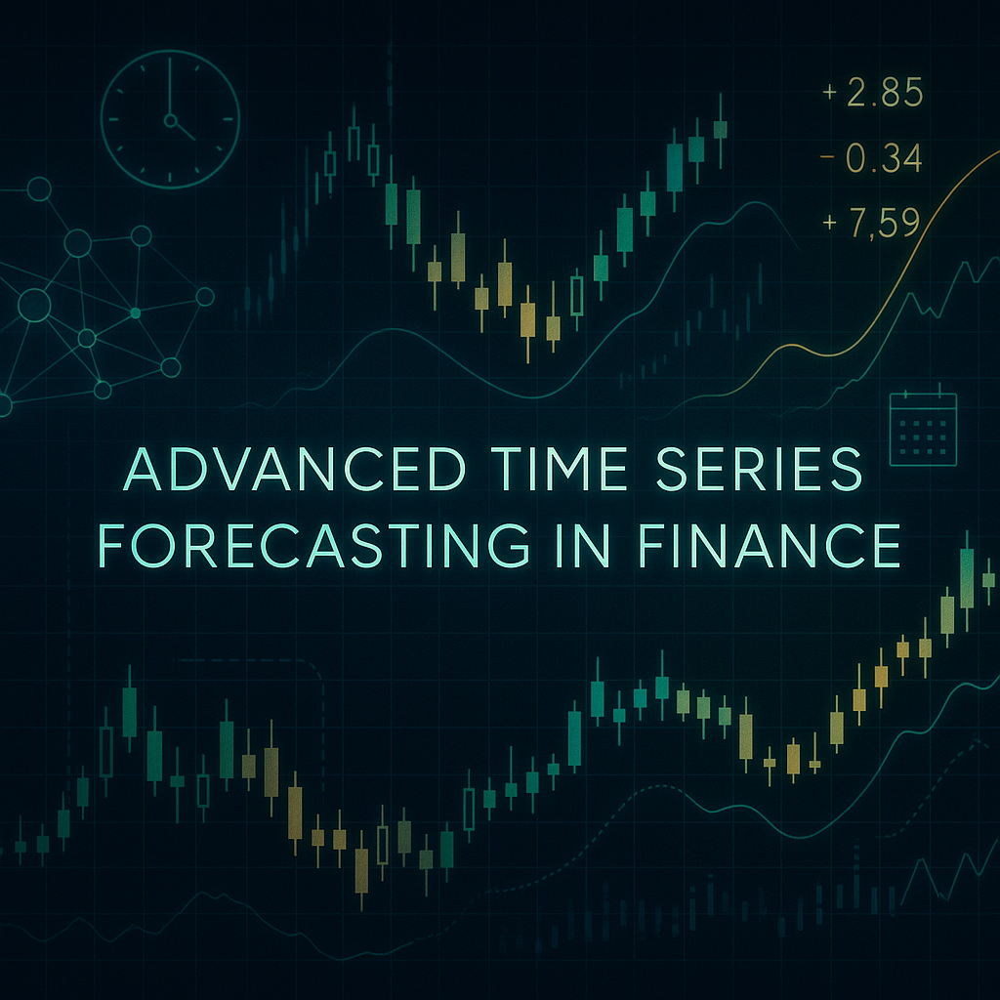

Time Series Forecasting for fincance
## Repository Link

(https://github.com/Ela200/FinanceGroup)

## Description

This project aims to forecast stock returns using a diverse set of models, ranging from traditional statistical techniques like ARIMA and GARCH to machine learning algorithms such as XGBoost, LightGBM, CatBoost, and Random Forest. Additionally, deep learning architectures including RNN, LSTM, and N-BEATS, as well as the Prophet model, were implemented to explore their effectiveness in capturing financial time series dynamics. The objective was to experiment with various modeling approaches and understand their practical implementation challenges and predictive behaviors on real stock market data.

### Task Type

Regression

### Results Summary

- **Best Model:** LightGBM
- **Evaluation Metric:** MAE and RMSE
- **Result:** 0.03406 MAE score over the 20 stocks and 0.04592 RMSE score over the 20 stocks 
- 

## Documentation

1. **[Literature Review](0_LiteratureReview/README.md)**
2. **[Dataset Characteristics](1_DatasetCharacteristics/exploratory_data_analysis.ipynb)**
3. **[Baseline Model](2_BaselineModel/baseline_model.ipynb)**
4. **[Model Definition and Evaluation](3_Model/model_definition_evaluation)**
5. **[Presentation](4_Presentation/README.md)**

## Cover Image

